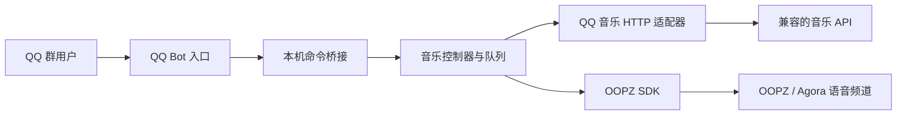

# OOPZ Music Bot

一个可自托管的 QQ 群音乐机器人：群成员通过 `@机器人` 点歌，机器人搜索歌曲、维护队列，并把音频推送到指定的 OOPZ 语音频道。

这个仓库是独立运行项目，不需要复制到另一套 Bot 源码中。控制面板和网页播放器已移除，所有操作都通过 QQ 群命令完成。

## 能力

- 点歌、搜歌、候选选择
- QQ 音乐排行榜及批量入队
- 播放队列、状态、暂停、继续、切歌和停止
- 查询 OOPZ 语音频道及在线成员
- 群组白名单和内部桥接鉴权
- 可选后台归档任务和 QQ 群文件上传
- 单一 CLI、配置检查、频道发现、Docker 和 systemd 部署

## 架构



机器人、内部 API、队列和 OOPZ SDK 运行在同一个 Python 进程中。内部桥接固定监听回环地址，不需要开放公网端口。QQ 音乐接口作为独立 HTTP 服务配置，本仓库不包含该服务端。

详细设计见 [docs/ARCHITECTURE.md](docs/ARCHITECTURE.md)。

## 快速开始

### 方式一：Docker

要求 Docker Engine 24+ 和 Docker Compose。

```bash
git clone <你的仓库地址> oopz-music-bot
cd oopz-music-bot
python scripts/init_config.py
```

编辑 `.env`，至少填写 QQ Bot、OOPZ 登录信息、目标频道和音乐接口地址，然后执行：

```bash
docker compose up -d --build
docker compose logs -f bot
```

如果音乐 API 运行在 Docker 主机的 `3200` 端口，将 `.env` 设置为：

```dotenv
QQ_MUSIC_BASE_URL=http://host.docker.internal:3200
```

容器不暴露端口；它只主动连接 QQ、OOPZ 和音乐接口。

### 方式二：本地安装

要求 Python 3.11+。默认安装只包含音乐 Bot；只有启用可选文件任务时才需要 Node.js 18+。

Linux / macOS：

```bash
python3 scripts/init_config.py
sh scripts/bootstrap.sh
```

Windows PowerShell：

```powershell
python .\scripts\init_config.py
.\scripts\bootstrap.ps1
```

如需同时安装可选文件任务，运行脚本前设置 `OOPZBOT_INSTALL_JM=1`。

安装后编辑 `.env`，依次执行：

```bash
oopzbot discover   # 列出 OOPZ 域、文字频道和语音频道 ID
oopzbot check      # 离线检查配置
oopzbot start      # 启动
```

## 配置

所有配置均来自 `.env`。运行 `python scripts/init_config.py` 会复制公开模板，并生成随机的内部桥接 Token。

最小配置包括：

```dotenv
QQBOT_APP_ID=
QQBOT_APP_SECRET=

OOPZ_LOGIN_PHONE=
OOPZ_LOGIN_PASSWORD=

QQBOT_OOPZ_AREA_ID=
QQBOT_OOPZ_TEXT_CHANNEL_ID=
QQBOT_OOPZ_VOICE_CHANNEL_ID=

QQ_MUSIC_BASE_URL=http://127.0.0.1:3200
```

完整说明见 [docs/CONFIGURATION.md](docs/CONFIGURATION.md)。真实 `.env`、Cookie、Token、日志和运行数据已被 Git 忽略。

## 群命令

```text
点歌 <歌名>        搜索并播放或加入队列
搜歌 <关键词>      返回候选歌曲
选歌 <编号>        选择最近一次搜索结果
排行榜             查看榜单
榜单 <ID或名称>    查看榜单歌曲
榜单点歌 <编号>    播放榜单歌曲
榜单批量 <数量>    批量加入队列，最多 10 首
状态               当前播放与进度
队列               当前及待播歌曲
暂停 / 继续
切歌 / 停止
在线 / 有谁         查看 OOPZ 语音频道成员
帮助
```

所有 QQ 群命令都需要先 `@机器人`。

## 开发

```bash
python -m pip install ".[dev]"
python -m compileall -q -f oopzbot
python -m unittest discover -s tests -v
ruff check oopzbot tests
python -m build
```

上传器测试：

```bash
npm ci --prefix tools/qqbot-uploader
npm test --prefix tools/qqbot-uploader
```

## 部署

- Docker：使用仓库根目录的 `compose.yaml`。
- Linux 原生服务：参考 [docs/DEPLOYMENT.md](docs/DEPLOYMENT.md) 和 `deploy/oopzbot.service`。
- 内部桥接只能监听 `127.0.0.1`、`localhost` 或 `::1`。
- 不要把 `.env`、音乐 Cookie、QQ Secret 或 OOPZ 凭据提交到 Git。

## 许可证

[MIT](LICENSE)

本项目使用但不复制 OOPZ SDK、QQ Bot SDK 和音乐接口服务的源码。第三方组件仍适用各自许可证；音乐接口服务需由部署者自行选择和审查。
