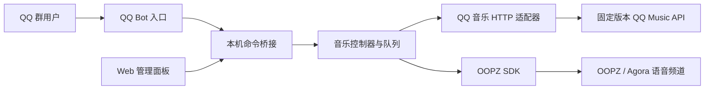

# OOPZ Music Bot

> 只需要 QQ 群 JM 下载功能？已抽成独立、可直接 Docker 部署的 [JM QQ Bot](jm-qqbot/README.md)。

一个可自托管的 QQ 群音乐机器人：群成员通过 `@机器人` 点歌，机器人搜索歌曲、维护队列，并把音频推送到指定的 OOPZ 语音频道。

机器人通过 QQ 群命令交互，支持 Docker Compose、systemd 和本地 Python 环境部署。

## 能力

- 点歌、搜歌、候选选择
- QQ 音乐排行榜及批量入队
- 播放队列、状态、暂停、继续、切歌和停止
- 查询 OOPZ 语音频道及在线成员
- 群组白名单和内部桥接鉴权
- 可选后台归档任务和 QQ 群文件上传
- Web 管理面板：实时状态、完整队列、搜歌和逐条删除
- 单一 CLI、配置检查、频道发现、Docker 和 systemd 部署

## 架构



机器人、内部 API、队列和 OOPZ SDK 运行在同一个 Python 进程中。本地安装时内部桥接固定监听回环地址；Compose 模式只向私有容器网络开放并保留令牌鉴权。默认使用项目锁定版本的 `Rain120/qq-music-api`，Docker Compose 将音乐接口和 Web 面板作为独立服务运行。

详细设计见 [docs/ARCHITECTURE.md](docs/ARCHITECTURE.md)。

## 快速开始

### 方式一：Docker

要求 Docker Engine 24+ 和 Docker Compose。

```bash
git clone <你的仓库地址> oopz-music-bot
cd oopz-music-bot
python scripts/init_config.py
```

编辑 `.env`，至少填写 QQ Bot、OOPZ 登录信息和目标频道，然后执行：

```bash
docker compose up -d --build
docker compose logs -f bot
```

Compose 会启动 `bot`、固定版本的 `qqmusic` 和 `panel`。音乐接口和机器人桥接只在容器内部网络开放；面板默认监听宿主机 `127.0.0.1:3000`，自带 HTTP Basic Auth（启动前必须设置 `OOPZ_PANEL_PASSWORD`），适合由 Nginx/Caddy 加 HTTPS 后对外提供。

### 方式二：本地安装

要求 Python 3.11+、Node.js 18+、npm 和 Git。Node.js 与 Git 用于安装项目锁定的 QQ 音乐 API。

Linux / macOS：

```bash
sh install.sh
```

Windows PowerShell：

```powershell
.\install.ps1
```

如需同时安装可选文件任务：

```bash
sh install.sh --with-jm
```

```powershell
.\install.ps1 -WithJm
```

安装脚本默认下载并固定到已经适配的 QQ 音乐 API 提交，同时通过交互式问题选择其他组件，并逐项填写 QQ Bot、OOPZ 和频道配置。Secret、密码和 Cookie 使用隐藏输入；检测到已有 `.env` 时可以直接保留或逐项修改。

填写 OOPZ 登录信息后，向导会查询账号加入的域。选择域或输入域 ID 后，文字频道和语音频道会分别显示为编号列表，选中后自动写入配置。

脚本支持重复运行，并保留已有 `.env`。也可以使用参数控制安装行为：

| Linux / macOS | Windows PowerShell | 作用 |
| --- | --- | --- |
| `--with-jm` | `-WithJm` | 安装 JM 文件任务和 Node.js 上传器 |
| `--skip-browser` | `-SkipBrowser` | 跳过 Chromium 下载 |
| `--external-music-api` | `-ExternalMusicApi` | 不安装默认 API，改用已有兼容服务 |
| `--non-interactive` | `-NonInteractive` | 使用默认选项，适合自动化部署 |
| `--python PATH` | `-Python PATH` | 指定 Python 3.11+ 可执行文件 |

安装后编辑 `.env`。Linux / macOS 执行：

```bash
.venv/bin/oopzbot discover   # 列出 OOPZ 域、文字频道和语音频道 ID
.venv/bin/oopzbot check      # 离线检查配置
.venv/bin/oopzbot start      # 启动
```

Windows PowerShell 执行：

```powershell
.\.venv\Scripts\oopzbot.exe discover
.\.venv\Scripts\oopzbot.exe check
.\.venv\Scripts\oopzbot.exe start
```

## 配置

所有配置均来自 `.env`。运行 `python scripts/init_config.py` 会复制公开模板，并生成随机的内部桥接 Token。

最小配置包括：

```dotenv
QQBOT_APP_ID=
QQBOT_APP_SECRET=

OOPZ_LOGIN_PHONE=
OOPZ_LOGIN_PASSWORD=

QQBOT_OOPZ_AREA_ID=
QQBOT_OOPZ_TEXT_CHANNEL_ID=
QQBOT_OOPZ_VOICE_CHANNEL_ID=

QQ_MUSIC_MANAGED=true
QQ_MUSIC_BASE_URL=http://127.0.0.1:3200
```

完整说明见 [docs/CONFIGURATION.md](docs/CONFIGURATION.md)。Git 忽略规则覆盖 `.env`、Cookie、Token、日志和运行数据。

## 群命令

```text
点歌 <歌名>        搜索并播放或加入队列
搜歌 <关键词>      返回前 10 首候选歌曲
选歌 <编号>        选择最近一次搜索结果
面板 / 队列        显示当前播放、待播队列和删除按钮
删除 <编号...>     删除指定待播歌曲，例如：删除 2 5
排行榜             查看榜单
榜单 <ID或名称>    查看榜单歌曲
榜单点歌 <编号>    播放榜单歌曲
榜单批量 <数量>    批量加入队列，最多 10 首
状态               当前播放与进度
队列               当前及待播歌曲
暂停 / 继续
切歌 / 停止
在线 / 有谁         查看 OOPZ 语音频道成员
帮助
```

所有 QQ 群命令都需要先 `@机器人`。

## 开发

```bash
python -m pip install ".[dev]"
python -m compileall -q -f oopzbot
python -m unittest discover -s tests -v
ruff check oopzbot tests
python -m build
```

上传器测试：

```bash
npm ci --prefix tools/qqbot-uploader
npm test --prefix tools/qqbot-uploader
```

## 部署

- Docker：使用仓库根目录的 `compose.yaml`。
- 从旧版 `main.py + qqbot_service.py + 独立 QQMusic API` 迁移：按 [旧版迁移到 Docker 指南](docs/MIGRATION_FROM_LEGACY.md) 执行。
- Web 面板：默认地址 `http://127.0.0.1:3000`，自带登录保护；公网使用前必须放在 HTTPS 反向代理后。
- Linux 原生服务：参考 [docs/DEPLOYMENT.md](docs/DEPLOYMENT.md) 和 `deploy/oopzbot.service`。
- 内部桥接在原生部署中只能监听回环地址；Docker 私网模式由 Compose 显式启用，且不映射宿主机端口。
- 不要把 `.env`、音乐 Cookie、QQ Secret 或 OOPZ 凭据提交到 Git。

## 许可证

[MIT](LICENSE)

OOPZ SDK、QQ Bot SDK、默认安装的 QQ Music API 及其他第三方组件适用各自许可证，详见 [THIRD_PARTY.md](THIRD_PARTY.md)。
