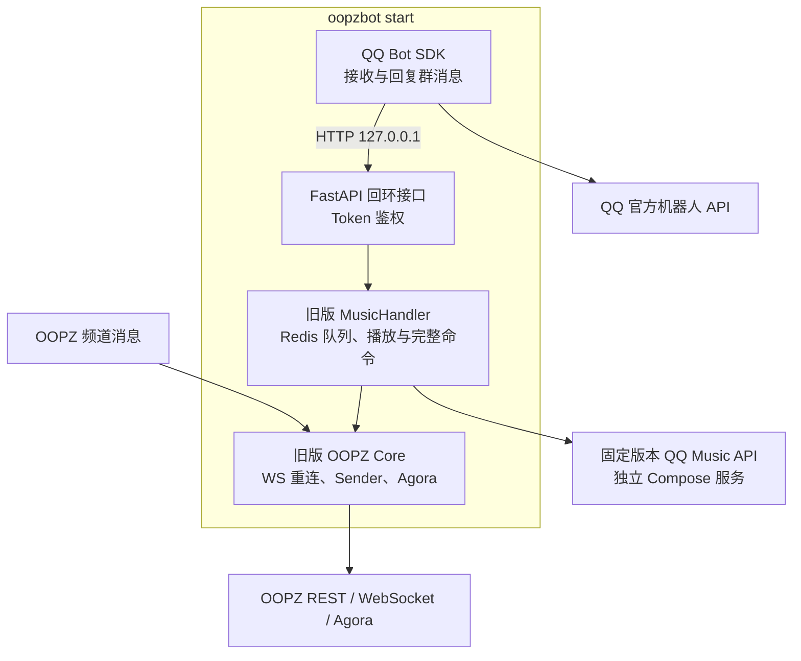
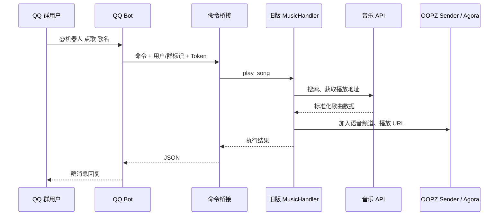

# 架构说明

## 进程模型

Docker 模式默认在主进程中嵌入迁移前的 OOPZ 核心。QQ、OOPZ 聊天和新面板共享同一个 MusicHandler 与 Redis 队列：

内部 HTTP 桥接负责隔离 QQ SDK 的事件循环与 OOPZ 运行时；本地部署只允许回环客户端，Compose 中只向私有容器网络开放，并始终校验随机 Token。

## 模块

| 模块 | 职责 |
| --- | --- |
| `oopzbot/app.py` | CLI、配置加载、进程生命周期和内部 API 启动 |
| `oopzbot/config.py` | 类型化环境变量、校验和 Token 生成 |
| `oopzbot/qqbot.py` | QQ 群消息接收、回复和可选任务编排 |
| `oopzbot/bridge.py` | 命令解析、搜索会话、排行榜会话和鉴权 |
| `oopzbot/legacy_runtime.py` | 将旧版 OOPZ 核心嵌入当前进程并提供桥接适配 |
| `legacy_oopzbot/src/` | 迁移前的消息、管理、插件、语音和 Redis 音乐核心 |
| `oopzbot/controller.py` | 关闭旧核心时使用的精简 SDK 回退控制器 |
| `oopzbot/music.py` | QQ 音乐 HTTP 响应兼容和数据标准化 |
| `oopzbot/qqmusic_service.py` | 固定版本音乐 API 的校验、启动、就绪检测与关闭 |
| `oopzbot/runtime.py` | OOPZ SDK 的线程安全同步门面 |
| `oopzbot/jm_worker.py` | 可选后台归档任务 |
| `tools/qqbot-uploader/` | 可选 QQ 群文件上传器 |

## 音乐命令调用链

## 并发模型

- QQ Bot SDK 管理自己的事件循环。
- FastAPI 在后台线程中监听回环端口。
- 旧版 OOPZ WebSocket 使用心跳、失效检测、凭据刷新和指数退避重连。
- OOPZ 消息由分片工作队列处理，同一频道保持顺序。
- 播放队列由 Redis 按域隔离并持久化；Redis 不可用时旧核心会暂时回退到内存。
- Agora 浏览器运行在专用线程，支持远程地址失败后的本地下载兜底和预加载。
- 耗时归档任务使用独立子进程，不阻塞消息处理。
- 本地部署由 Python 主进程托管固定版本 QQ 音乐 API 子进程；Docker 部署使用独立内部容器。

## 数据与持久化

Compose 使用启用 AOF 的 Redis 容器保存播放队列。`data/legacy/` 保存旧核心数据库、插件状态、登录刷新结果和日志；`data/` 还保存 JM 状态。镜像重建不会清除这些内容，`docker compose down -v` 会删除 Redis 卷，因此迁移和日常维护都不应使用 `-v`。

## 安全边界

- 内部 API 强制使用回环地址。
- 每个内部命令请求校验 `QQBOT_BRIDGE_TOKEN`。
- QQ 群可通过 `QQBOT_ALLOWED_GROUP_OPENIDS` 设置白名单。
- 可选后台任务可另设用户白名单。
- Secret 只从环境变量读取，不写入日志或 API 响应。
- 音乐 API 子进程使用最小环境变量集合，不继承 QQ Bot 和 OOPZ 凭据。
- 旧版配置和 RSA 私钥不会进入镜像或 Git；账号密码刷新结果只写入 `data/legacy/`。
- 旧版 Web 管理端口和新面板默认只绑定宿主机 `127.0.0.1`。
