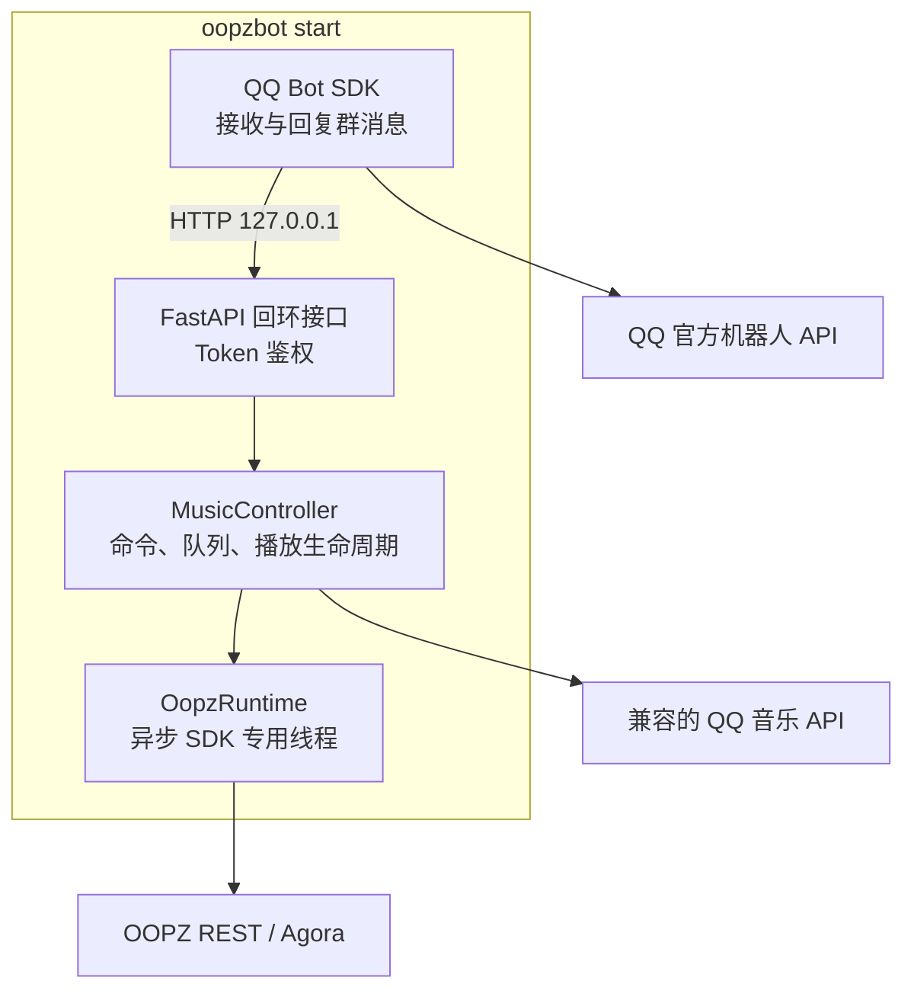
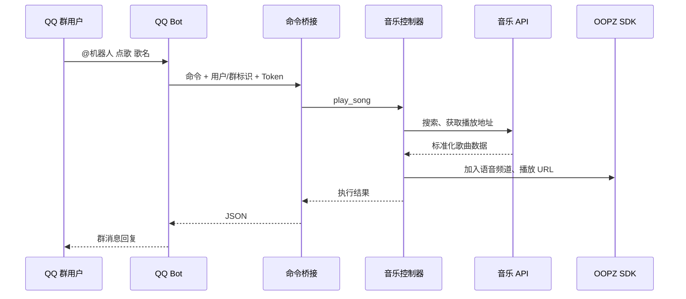

# 架构说明

## 进程模型

OOPZ Music Bot 默认只启动一个 Python 进程，其中包含四个边界：

内部仍保留 HTTP 桥接，是为了隔离 QQ SDK 的事件循环与 OOPZ SDK 的异步运行时；接口只允许回环客户端，并校验随机 Token。

## 模块

| 模块 | 职责 |
| --- | --- |
| `oopzbot/app.py` | CLI、配置加载、进程生命周期和内部 API 启动 |
| `oopzbot/config.py` | 类型化环境变量、校验和 Token 生成 |
| `oopzbot/qqbot.py` | QQ 群消息接收、回复和可选任务编排 |
| `oopzbot/bridge.py` | 命令解析、搜索会话、排行榜会话和鉴权 |
| `oopzbot/controller.py` | 内存队列、播放控制和自动续播 |
| `oopzbot/music.py` | QQ 音乐 HTTP 响应兼容和数据标准化 |
| `oopzbot/runtime.py` | OOPZ SDK 的线程安全同步门面 |
| `oopzbot/jm_worker.py` | 可选后台归档任务 |
| `tools/qqbot-uploader/` | 可选 QQ 群文件上传器 |

## 音乐命令调用链

## 并发模型

- QQ Bot SDK 管理自己的事件循环。
- FastAPI 在后台线程中监听回环端口。
- OOPZ SDK 运行在单独的 asyncio 线程；其他线程通过 `run_coroutine_threadsafe` 调用。
- 队列使用可重入锁保护。
- 播放监控线程每三秒查询播放状态，结束后自动推进队列。
- 耗时归档任务使用独立子进程，不阻塞消息处理。

## 数据与持久化

播放队列当前保存在内存中，重启后清空。这使默认部署无需 Redis 或数据库。`data/` 只保存可选后台任务的临时文件和耗时样本，并被 Git 忽略。

后续如果需要多实例或重启恢复，可以在不改变命令层的情况下，为 `MusicQueue` 增加 SQLite/Redis 实现。

## 安全边界

- 内部 API 强制使用回环地址。
- 每个内部命令请求校验 `QQBOT_BRIDGE_TOKEN`。
- QQ 群可通过 `QQBOT_ALLOWED_GROUP_OPENIDS` 设置白名单。
- 可选后台任务可另设用户白名单。
- Secret 只从环境变量读取，不写入日志或 API 响应。
- Docker 镜像不声明对外端口。
